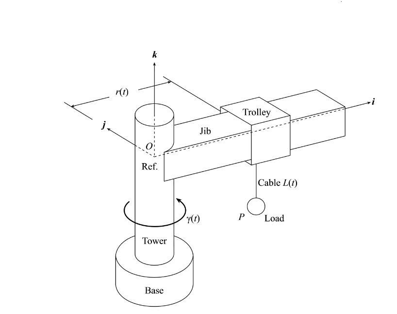

## Semesrální práce z předmětu ŘSP: "Tower crane"

# Small description:

Semestral project on controlling method of tower crane for the payload of the crane to not oscilate, while crane is rotating with it or shifting it along its arm.

# Documentation:

The documentation of this particular project don't exist, but I was guided by: MANUAL_ULOHY.pdf and MAT_ODVOZENI.pdf, while i was working on this assignment.

# Scheme of the task:

